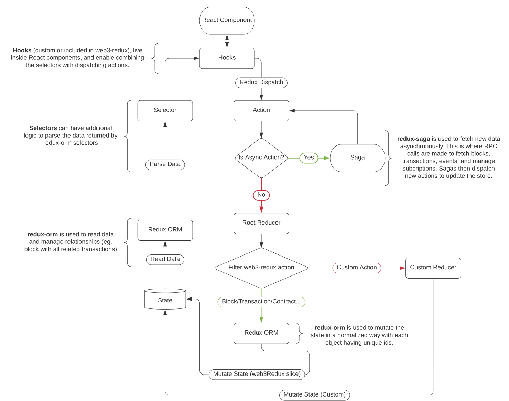

# Web3 Redux Docs


Web3 Redux Library.

## Table of Contents

-   [Installing](#installing)
-   [Architecture](#architecture)
-   [Interfaces](#interfaces)
-   [Getting Started](#getting-started)
-   [Metamask](#metamask)
-   [Advanced](#advanced)

## Installing

Use your favorite node package manager to install `web3-redux` and the required peer dependencies. We recommend using [pnpm](https://github.com/pnpm/pnpm) as a disk space efficient drop-in replacement of npm.

```
pnpm install redux redux-saga react-redux web3 @owlprotocol/web3-redux
```

## Architecture

Overview of the overall architecture of the library.



-   All web3-redux data is stored under the `web3Redux` slice of the store as a normalized json store (State). The overall interface of the state can be found under [State](./interfaces/State).
-   [Selectors](https://github.com/reduxjs/reselect) for each [redux-orm](https://github.com/redux-orm/redux-orm) model are the preferred way to then read this data.
-   Redux ORM models are meant to represent blockchain data such as [Account](./interfaces/Account), [Block](./interfaces/Block), [Transaction](./interfaces/Transaction), [ContractEvent](./interfaces/ContractEvent)
-   State is mutated by the dispatching of Actions. Actions can be synchronous, for simple CRUD operations on the state, or asynchronous, for network fetch operations. Async actions are handled by [redux-saga](https://github.com/redux-saga/redux-saga) and will usually dispatched a new CRUD action after fetching data.
-   Hooks such as `useDispatch` and `useSelector`, enable Redux components to use the React Context API to read/write to the store by combinding selectors and actions.

## Interfaces

Here is a list of all the interfaces used by web3-redux:

-   [Account](./interfaces/Account.Account-1)
-   [BlockHeader](./interfaces/Block.BlockHeader), [BlockTransaction](./interfaces/Block.BlockTransaction)
-   [Transaction](./interfaces/Transaction.Transaction-1)
-   [Contract](./interfaces/Contract.Contract-1)
-   [ContractEvent](./interfaces/ContractEvent.ContractEvent-1)
-   [ContractSend](./interfaces/ContractSend.ContractSend-1)
-   [EthCall](./interfaces/EthCall.EthCall-1)
-   [Network](./interfaces/Network.Network-1)
-   [BlockSync](./interfaces/Sync.BlockSync), [TransactionSync](./interfaces/Sync.TransactionSync), [EventSync](./interfaces/Sync.EventSync)

## Hooks

To easily read/sync data, we recommend using the built-in hooks when possible to automatically combine selectors & action dispatchers.

**EVM Blockchain**

-   [useBlock](./modules/Block#useBlock): Fetch specific block.
-   [useLatestBlock](./modules/Network#useLatestBlock): Fetch latest block (TBD currently just fetches latest block in store and does not query network).
-   [useBlockSync](./modules/Block#useBlockSync): Subscribe to new blocks.
-   [useTransaction](./modules/Transaction#useTransaction): Fetch specific transaction.

**Smart Contracts / Externally Owned Accounts**

-   [useGetBalance](./modules/Contract#useGetBalance): Get balance of address.
-   [useGetNonce](./modules/Contract#useGetNonce): Get nonce (tx count) of address.
-   [useGetCode](./modules/Contract#useGetCode): Get code of address. `0x` indicates an EOA.
-   [useContractCall](./modules/Contract#useContractCall): Make a contract call.
-   [useEvents](./modules/Contract#useEvents): Get past or sync contract event logs.
-   [useSupportsInterface](./modules/Contract#useSupportsInterface): Check if contract supports interface using ERC165.
-   [useERC20](./modules/Contract#useERC20): Common ERC20 contract calls and events.
-   [useERC721](./modules/Contract#useERC721): Common ERC721 contract calls and events.
-   [useERC1155](./modules/Contract#useERC1155): Common ERC1155 contract calls and events.

**IPFS**

-   [useIpfs](./modules/Ipfs#useIpfs): Fetch IPFS resource using content hash.

**Etherscan API**

-   [useFetchAbi](./modules/Contract#useFetchAbi): Fetch contract ABI using Etherscan API.
-   [useFetchTransactions](./modules/Contract#useFetchTransaction): Fetch transactions for address using Etherscan API.

**Experimental**

-   [useGetPastLogs](./modules/ContractEvent#useGetPastLogs): Fetch past logs using raw subscribe filter. Enables syncing event across multiple smart contracts efficiently. (TBD)
-   [useGetAssets](./modules/ContractEvent#useGetAssets): Fetch all ERC20/ERC721/ERC1155 `Transfer` events associated with an `address` to get a theoretical subset of all assets that `address` potentially owns. Not guaranteed to work with non-interface compliant assets but offers an alternative to off-chain indexing. **(TBD)**

## Getting Started

Before you begin, you might want to get familiar with some of the libraries this "meta-library" is built with:

-   [React Hooks](https://reactjs.org/docs/hooks-intro.html)
-   [redux](https://redux.js.org/)
-   [reselect](https://github.com/reduxjs/reselect)
-   [redux-orm](https://redux-orm.github.io/redux-orm/)
-   [web3.js](https://web3js.readthedocs.io/en/v1.3.0/)
-   [redux-saga](https://redux-saga.js.org/)

### Initialize the Redux Store

In most situations, you will want to add web3-redux to your existing redux store. The web3Reducer MUST be stored at the `web3Redux` key in your store.

```typescript
//store.ts
import { combineReducers, createStore, applyMiddleware } from 'redux';
import createSagaMiddleware from 'redux-saga';
import { web3Reducer, web3Saga } from '@leovigna/web3-redux';

const reducers = combineReducers({
    web3Redux: web3Reducer,
});

const sagaMiddleware = createSagaMiddleware();
const store = createStore(reducers, applyMiddleware(sagaMiddleware));
sagaMiddleware.run(web3Saga);

export default store;
```

Then follow the standard `react-redux` configuration [guide](https://redux.js.org/usage/configuring-your-store) to add a `Provider` component to wrap your entire React app in the redux context.

```typescript
//index.tsx
import React from 'react';
import ReactDOM from 'react-dom';
import { Provider } from 'react-redux';
import App from './App';
import store from './store';

ReactDOM.render(
    <React.StrictMode>
        <Provider store={store}>
            <App />
        </Provider>
    </React.StrictMode>,
);
```

### Add a network

All entities in the `web3-redux` store are indexed by networkId. `web3-redux` let's you sync multiple networks concurrently (eg. sync Mainnet & Ropsten blocks). To enable this however, you must first configure a network by adding it to the store and passing it a web3 instance.

A good place to do this in your React app is on app mount with a `useEffect` hook. Note that the component must be have access to the Redux context (see earlier section). Below a simple example for adding a network to the store on app mount. Here we assume the ethereum RPC is simply defined as an environment variable. For more dynamic configuration such as integration with Metamask, check out [TBD](#).

```typescript
//App.tsx
import { useEffect } from 'react';
import { useDispatch } from 'react-redux';
import Web3 from 'web3';
import { Network } from '@leovigna/web3-redux';

const App = () => {
    const dispatch = useDispatch();
    useEffect(() => {
        const networkId = '1';
        const web3 = new Web3(process.env.REACT_APP_RPC);
        dispatch(Network.create({ networkId, web3 })); //create network
    }, []); //Runs once on app mount
    //...
};
```

### Add a contract

One you've added a network, add a contract by dispatching a `Contract.create` action.
Bloew we've extended the previous example to add a contract.

```typescript
//App.tsx
import { useEffect } from 'react';
import { useDispatch } from 'react-redux';
import Web3 from 'web3';
import { Network } from '@leovigna/web3-redux';

const App = () => {
    const dispatch = useDispatch();
    useEffect(() => {
        const networkId = '1';
        const web3 = new Web3(process.env.REACT_APP_RPC);
        dispatch(Network.create({ networkId, web3 })); //create network
        const address = process.env.REACT_APP_ABI;
        const abi = dispatch(Contract.create({ networkId, address, abi })); //Some smart contract abi //create contract
    }, []); //Runs once on app mount
    //...
};
```

Alternatively, if not using hooks or React in general, you can manually dispatch a eth call action and use the selector as follows:

```typescript
//Create contract
store.dispatch(Contract.create({ networkId, address, abi }));
```

### Contract call

The easiest way make a contract [method call](https://web3js.readthedocs.io/en/v1.5.2/web3-eth-contract.html#methods-mymethod-call) is using the `useContractCall` hook. This combines dispatching a redux action and using a selector to return the updating result.

Here we use `once` as the sync parameter to instruct the hook to dispatch a single eth call. For more info on complex sync strategies, see the sync documentation [TBD](#)

```typescript
import { Contract } from '@leovigna/web3-redux';
const ERC20Component = ({ networkId, address, account }) => {
    //Make contract call
    const [balanceOf] = Contract.useContractCall(networkId, address, 'balanceOf', [account], { sync: 'once' });
    //...
};
```

Alternative in plain Typescript:

```typescript
//Make contract call
store.dispatch(Contract.call({
    networkId,
    address,
    method: 'balanceOf',
    args: [account],
}));
const balance = Contract.selectContractCall(state, {networkId, address }, 'balanceOf', { args: [account] } ]})
```

### Contract Event subscription

Another way to sync data from your smart contract is to use [event subscriptions](https://web3js.readthedocs.io/en/v1.5.2/web3-eth-contract.html#contract-events). The `useEvents` hook is helpful for this.
Here we enable `sync` and `past` to both get new updates (using websocket subscription) and past events (using [getPastEvents](https://web3js.readthedocs.io/en/v1.5.2/web3-eth-contract.html#getpastevents)). Note that getting past events can be an expensive operation, and we recommend disabling or limiting (with block range parameters) the fetching of old events when possible.
The `web-redux` event subscription hook is configured to automatically start/stop the correct subscription if any relevant params of the hook change. Alternatively, you can use the `subscribe()/unsubscribe()` handlers for more granular control such as handling user interactions.

```typescript
import { Contract } from '@leovigna/web3-redux';
const ERC20Component = ({ networkId, address, account }) => {
    // Sync events
    const [transfers, { subscribe, unsubsribe }] = Contract.useEvents(networkId, address, 'Transfer', [account], {
        sync: true,
        past: true,
        fromBlock: 'earliest',
        toBlock: 'latest',
    });
    //...
};
```

### Block subscription

To sync with on-chain events, it's a good idea to start a block subscription as it can be used as a reference point to keep data fresh. This is recommended but not required as some apps might use a different refresh mechanism.
The `web3-redux` block subscription hook is configured to automatically start/stop the correct subscription if the `networkId` parameter changes. Alternatively, you can use the `subscribe()/unsubscribe()` handlers for more granular control such as handling user interactions.

```typescript
//Blocks.tsx
import { Block } from '@leovigna/web3-redux';
const BlocksComponent = ({ networkId }) => {
    const [blocks, { subscribe, unsubsribe }] = Block.useBlockSync(networkId);
};
```

Alternatively, if not using hooks or React in general, you can manually dispatch a block sync action and use the selector as follows:

```typescript
import { Block, Network } from '@leovigna/web3-redux';
store.dispatch(Block.subscribe({ networkId: '1' }));
const blocks = Network.selectBlocks(store.getState());
```

## Contract Call Sync

`web3-redux` offers enhanced customizability of contract call syncing to avoid unecessary rpc calls. Contract call syncing is achieved by refreshing contract calls based on a set of parameters. To initiate contract call syncing, one must first dispatch a ContractCallAction.

There are 4 types of contract call syncing:

-   `once`: Call contract method once
-   `Block`: Call contract and refresh every block.
    `Evnet`: (TDB)
-   `Transaction`: Call contract and refresh every time a block includes a transaction to the contract.

Note: Both block sync and transaction sync require an existing block subscription to be first created.

By default we use Transaction syncing. See [Advanced/Optimising Contract Call Sync](#custom-contract-call-syncing) for more info.

## Sync Middleware

`web3-redux` comes with a built-in `Sync` data model which serves as a form of dynamic middleware that can be added, removed, and customized. There are three types of syncs, `BlockSync`, `EventSync`, and `TransactionSync` which each can trigger actions upon receiving updates to a new block, new event, or new transaction.

All three inherit from `BaseSync` which defines a set of `actions` to dispatch if the `filter` predicate matches the update. Sync middleware can be useful when looking to dispatch your own custom Redux action as a result of some blockchain update. They are also used as the building blocks for the Contract Call sync.

<b>Block Sync</b>

This middleware listens for `Block/CREATE` actions, and if a block matches its `filter` predicate, will dispatch its `actions`. The following example triggers every 5 blocks:

```typescript
store.dispatch(Sync.create({ id: '1', type: 'Block', filter: (block) => block.number % 5 == 0, actions }));
```

<b>Event Sync</b>

This middleware listens for `ContractEvent/CREATE` actions, and if an event matches its `filter` predicate, will dispatch its `actions`. The following example filters for events named `Transfer`:

```typescript
store.dispatch(Sync.create({ id: '1', type: 'Event', filter: (event) => event.name == 'Transfer', actions }));
```

<b>Transaction Sync</b>

This middleware listens for `Transaction/CREATE` actions, and if an event matches its `filter` predicate, will dispatch its `actions`. The following example filters for tranaction from a particular sender:

```typescript
store.dispatch(Sync.create({ id: '1', type: 'Transaction', filter: (tx) => tx.from == address, actions }));
```

## Metamask

See [Manual Network Initialization](#manual) for more detail.
Metamask can cause issues as the injected Web3 instance is mutable and changes as users change networks. To mitigate this, Networks can be initialized with 2 web3 instances, one for read-only calls (eg. Infura) and one for wallet signed send transactions (Metamask). This way, subcriptions and call syncs can continue to work even if a user changes networks.

Override the optional `web3Sender` parameter when initializing the Network and set it to the injected Web3 instance. The regular read-only web3 instance should

```typescript
const web3Sender = window.web3; //Metamask wallet, used for send transactions
const web3ReadOnly = new Web3('ws://localhost:8545'); //Used for calls/subscriptions
store.dispatch(Network.create({ networkId: '1', web3: web3ReadOnly, web3Sender }));
```

## Advanced

### Optimizing Contract Call Sync

By default, contracts use Transaction syncing but this can be customized for each specific contract call. This is can be a sub-optimal or even incorrect sync strategy.

Transaction syncing can be sub-optimal if a call's return value never changes. For example, an ERC19 token's name or symbol. In this case simply disable syncing with `sync: false`.

Transaction syncing assumes that the contract call values are only dependent on your contract's state and that this state is only changed by direct transactions to your contract. The basic logic for Transaction syncing is as follows: For each transaction in a new block, update contract call if `tx.to == contract.address`.
Examples of cases where this assumption might be incorrect include:

-   Contract call return value depends on block number
-   Contract state can be changed by a call to some proxy contract

In these cases we recommend switching to Block syncing, which will poll the contract call at every block. For even better optimization, it might be interesting in some cases to use a custom block or transaction sync.

### Custom Contract Call Sync

The interface of ContractCallBlockSync and ContractCallTransactionSync use a filter function returning whether a contract call should update. Customizing the filter function can help you create more optimized syncing depending on your use case.

```typescript
export interface ContractCallBlockSync {
    type: typeof CALL_BLOCK_SYNC;
    filter: (block: BlockHeader) => boolean;
}

export interface ContractCallTransactionSync {
    type: typeof CALL_TRANSACTION_SYNC;
    filter: (transaction: Transaction) => boolean;
}
```

Example sync strategies:

-   Sync every 4 blocks: `(block) => block.number % 5 == 0`
-   Sync for transactions to contract or proxy: `(tx) => tx.to === contract.address || tx.to === proxy.address`
